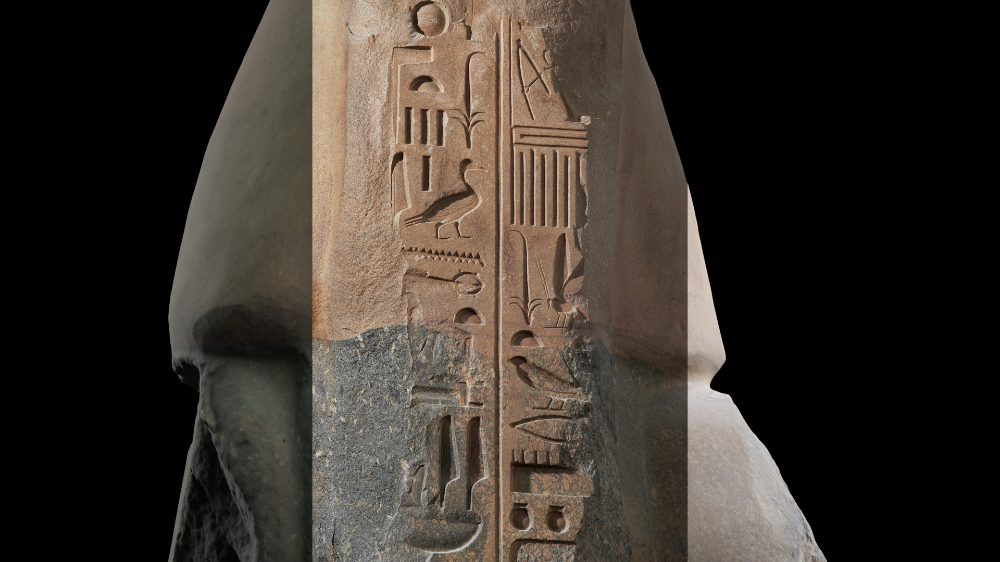

# image-matcher

Add-on for Blender that allows matching multiple 2D images to a corresponding 3D model. This uses OpenCV's Perspective-n-Point solver to estimate camera intrinsics (e.g. focal length, distortion coefficients) and extrinsics (camera position and orientation) based on pairs of 2D and 3D points.

This add-on builds on RT Studio's Camera Pnpoint Blender plugin: 
https://rtstudios.gumroad.com/l/camera_pnpoint / https://github.com/RT-studios/camera-pnpoint
Do consider buying their addon on gumroad/blender market to help support them making great Blender addons!

This plugin adds:
- Easier matching of multiple 2D images
- Point mode to allow one click addition of 2D/3D points
- UI to visualise list of points for each image
- Easier adjustment of camera parameters / background image directly in the plugin UI
- Export of camera parameters to JSON

For more information on the Perspective-n-Point process, see OpenCV's documentation: https://docs.opencv.org/4.x/d5/d1f/calib3d_solvePnP.html

## Installation + Tutorials

- There's a full video tutorial of installation + image matching on youtube: https://www.youtube.com/watch?v=3gHtWkfxcvo
- For installation instructions, see: [Installation](./docs/installation.md)
- For a step by step tutorial of image matching, see: [Image matching tutorial](./docs/image-matching.md)
- For a tutorial of making a video moving between each matched position, see: [Video tutorial](./docs/video.md). Note: this tutorial is advanced, and assumes prior Blender experience!

## Examples

You can see an example video moving between matched positions here: https://www.youtube.com/watch?v=zqXh3yGqvkA This uses publicly available data of the Ramesses II statue from the British Museum (data from [Sketchfab](https://sketchfab.com/3d-models/ramesses-ii-c98e1cab68134f4283f0448966f0835b) and [Collection Online](https://www.britishmuseum.org/collection/object/Y_EA19))


## Releases

Github Actions runs on this repository to automatically create releases when a
commit is pushed to main with a version tag like v1.0.0. This will automatically
create a zip file with only the required python files for installation in Blender.

To trigger this:
```
# Add a tag to last commit (on main)
git tag v1.0.0
git push origin --tags
```
