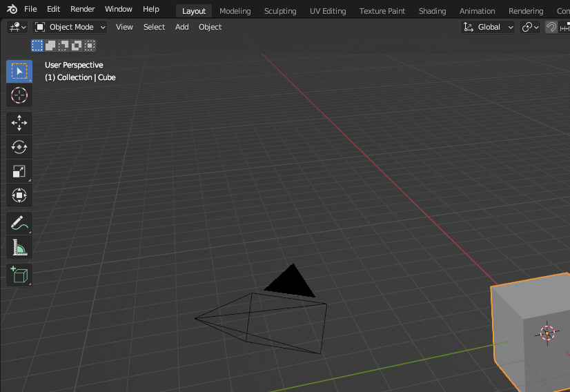
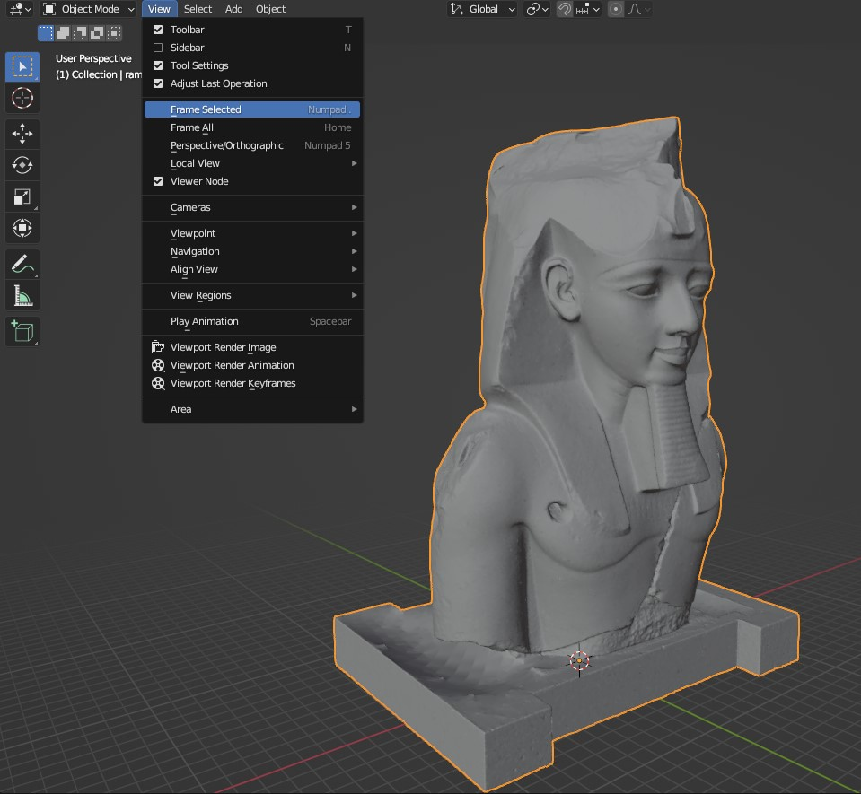
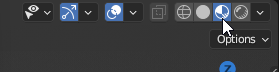
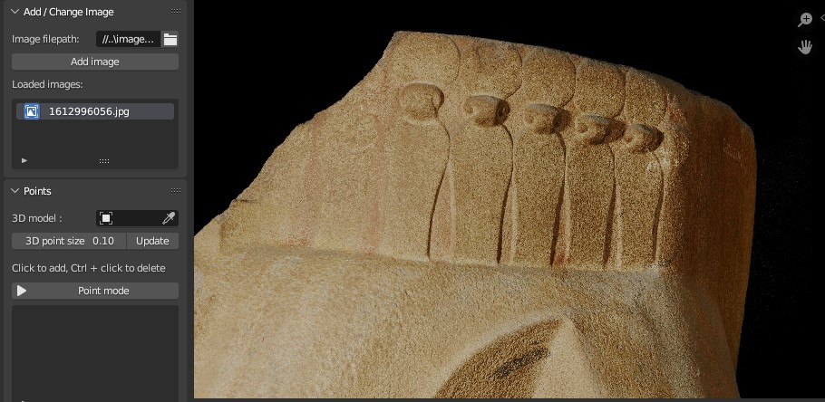
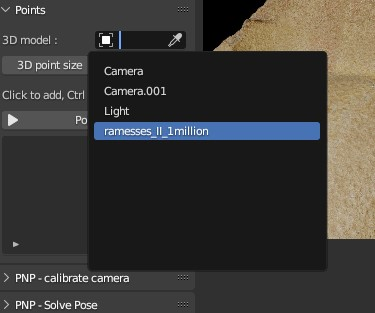
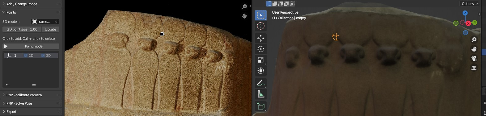
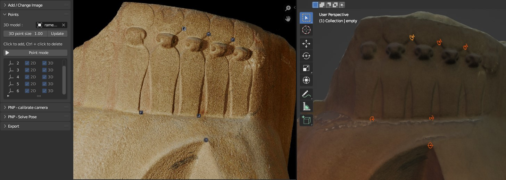
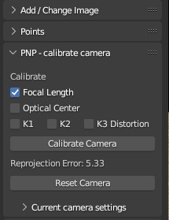
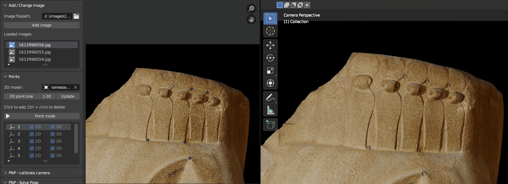

# Matching images

## Example data

For the rest of the tutorials, I will use a statue of Ramesses II from the British Museum as an example (museum number EA19). You can access the data to follow along here:

- [3D model on the British Museum's Sketchfab](https://sketchfab.com/3d-models/ramesses-ii-c98e1cab68134f4283f0448966f0835b)

- [Images from the British Museum's Collection online](https://www.britishmuseum.org/collection/object/Y_EA19)

For the 3D model, I use the .obj format one named 'ramesses_II_1million.obj'. For the images, I use the full resolution versions which can be accessed by clicking 'Use this image' in the bottom right and then 'Download this image' under 'Non-commercial use'.

## Saving your Blender file

Open Blender, click File > Save As.. and select a location to save your file.
Make sure you save regularly with File > Save, or Ctrl + S!

Note that Blender uses relative filepaths, so if you later move your Blender file you will likely break some links to images or 3D models.

## Setting up the workspace

You'll need two windows to use the add-on: one to view 2D images and one to view the 3D model.

To create this, hover your mouse over the top left corner of the 3D viewer until it turns into a cross.
Click and drag to the right to split your screen into two windows. Then click on the icon in the top left and select 'Movie clip editor'. Finally, select the 'Image Match' tab on the left side.

## Import the 3D model

First, delete the cube from the 3D viewer. Click on it and press Delete on your keyboard.

Then select File > Import in the top menu-bar of Blender and choose the file format of your 3D model. For the example data, this is 'Wavefront (.obj)'. Select your 3D model file and click import.

After a bit of time, your 3D model should appear. You can zoom to fit the whole model by pressing '.' on the keyboard numpad, or View > Frame Selected from the menu.

To show the textures of the 3D model, click the 'Viewport Shading' button in the top right of the 3D viewer.

## Navigating the 3D viewer

- **Rotate**: Middle click and drag
- **Pan**: Shift + Middle click and drag
- **Zoom**: Scroll

To reset the 3D view, click on your 3D model then press '.' on the keyboard numpad, or View > Frame Selected from the menu. To reset the viewing angle also, click '1' on the keyboard numpad, or View > Viewpoint > Front.

## Importing an image (Add/Change Image tab)

To import your first image, go to the 'Add/Change Image' tab and click the folder icon next to 'image filepath'. Select your image and click Accept.

Then click the 'Add image' button to open it in the viewer. You will see the image filename appear in the list of 'Loaded images'.

## Navigating the 2D viewer

- **Pan**: Middle click and drag
- **Zoom**: Scroll

## Adding corresponding points (Points tab)

The plugin requires you to select pairs of corresponding points on the 2D image and 3D model. You should select at least 6, but you can add more if you like.

First, select your 3D model by clicking in the box and selecting its name, or by clicking the eyedropper icon and selecting it in the 3D view.

Next, click the 'Point mode' button. This will enable Point mode, allowing you to left click in the 2D image or 3D model to add a point. Note that while you're in point mode you won't be able to interact with any other menu items! You can exit point mode at any time by right clicking, or pressing Esc on your keyboard.

Choose a feature that you can accurately locate on both the 2D image and 3D model. For example, for this image, I've chosen the location where two of the circles touch. Click on this location on the image and 3D model to add a pair of points. You should see it appear in the list under the 'Point mode' button, with both the 2D and 3D ticked.

If you add a point in the wrong location, you can delete it by Ctrl + clicking on it in either the 2D or 3D view.

If your 3D points appear too small, you can change their size by entering a number next to '3D point size' and clicking 'Update'.

Repeat this process until you have 6 or more point pairs. Try to make sure your points are spread out over your image and not bunched up in one location - this will help ensure a better match later in the process. You can check your point pairs by clicking each row in the list under the Point mode button (while not in point mode) - this will highlight the relevant points in both the 2D and 3D view.

## Camera calibration (PNP-calibrate camera tab)

The next step is to calibrate the camera 'intrinsics'. These are features like the focal length, optical centre and distortion coefficients of the camera used to take your 2D images. This is done using OpenCV.

Focal length has the largest effect out of all of these, so you can normally achieve a good match by only adjusting the focal length and leaving the optical centre / distortion at their default values.

If you already know the focal length of the camera (or optical centre etc) used to take your images, you can expand the 'current camera settings' dropdown and input them directly. Then you can skip to the next tutorial section.

If you don't know the focal length, or you're not achieving a good match at later steps, you'll want to calibrate it now. Make sure the checkbox next to 'Focal Length' is ticked, then click the 'Calibrate Camera' button. This will estimate the camera focal length based on your given point pairs. The 'Reprojection error' provided below the button gives an estimate of how well this estimation worked - lower numbers are better. If you're unhappy with the calibration, you can reset the camera to default values by clicking the 'Reset camera' button.

(By ticking the other checkboxes next to optical centre, or K1/2/3 distortion you can also estimate these based on your point pairs. This is usually not necessary though.)

## Solve Camera Pose (PNP-Solve Pose tab)

Now we can solve the camera 'extrinsics' i.e. its position and orientation in 3D space, using OpenCV. To do this, click the 'Solve Camera Pose' button. The 'Reprojection error' provided below the button gives an estimate of how well this worked - lower numbers are better.

To view the match, click the 'Toggle camera view' button. This will enter the matched camera (in the right window) and show the 2D image over the 3D model. You can toggle the 2D image on and off, by checking/un-checking the 'Show matched image' button. You can also adjust the 2D image opacity with the slider below. If you can't see the 3D model, it is likely an issue with the camera clip distance. You can adjust this under the 'Toggle camera view' button - for example, for this 3D model I changed the 'Clip end' to 2000m.

## What to do if your match looks bad?

If your match looks bad when you switch to camera view, there are a number of things you can try. First, check your point pairs - go to the points tab, and click on each row of the point list to highlight the corresponding 2D and 3D point. Are the points in the correct locations? If not, delete them and add them again. Make sure you're choosing features that are easy to accurately locate in both 2D and 3D e.g. corners, or the intersection of lines etc. 

Also, check if your points are spread out over the 2D image. If your image match looks bad in a certain area, then try adding more points there.

Once you've changed your points, make sure you 'Reset Camera' (in the PNP-calibrate camera tab), then 'Calibrate Camera' again, before you 'Solve Camera Pose'.

## Exporting matches (Export tab)

The camera positions of all matched images can be exported to JSON format.

First, make sure the correct 3D model is selected, then click on the folder icon next to 'Export filepath' to select a location to save the Json file. Then choose the export type - either Blender or ThreeJS. Selecting ThreeJS will convert the coordinates/camera parameters to ones compatible with three.js.

Finally, click 'Export matches' to create the Json file in the chosen location.

## Matching multiple images

You can easily match multiple 2D images to one 3D model. To add further 2D images, go back to the top tab 'Add/Change Image' and follow the instructions to add an image as before.

All loaded images will appear in the 'Loaded images' list in this tab. The currently active image is marked by a blue highlighted icon to the left of its name. To switch image, simply click on the icon in the correct row. It will be highlighted in blue, and all tabs below will switch to this image (e.g. showing the point pairs and camera settings for this image).

