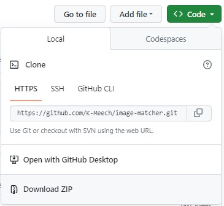
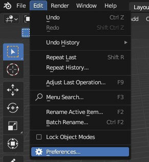
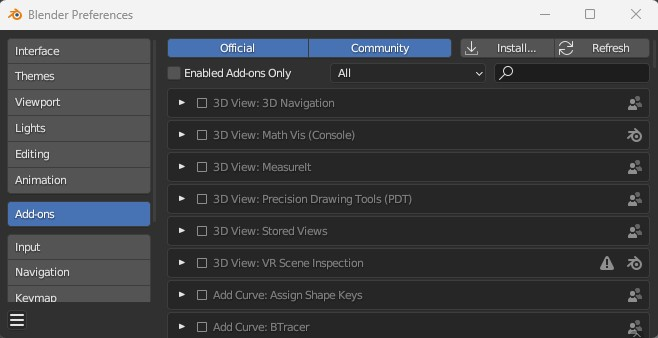
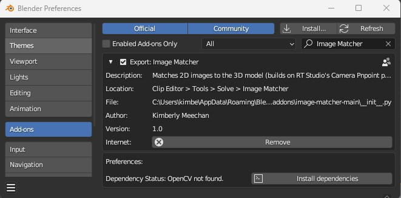
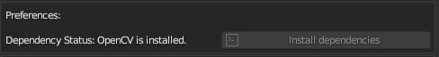

# Installation

## Installing Blender

Go to the Blender website (https://www.blender.org/) and download/install the latest version.

This add-on was developed with Blender 3.6, but it should work with any version of Blender. If you experience issues with other versions, report it as an issue on this repository and use version 3.6 from here: https://www.blender.org/download/previous-versions/ 

## Installing the add-on

Download a zip file of this repository from here: https://github.com/K-Meech/image-matcher, by clicking the green 'Code' button and selecting 'Download ZIP' 

Open Blender and select Edit > Preferences in the top menu bar. Then, select the 'Add-ons' tab on the left side.

Click 'Install...' at the top right of this window, and select the .zip file you just downloaded. Click 'Install Add-on'.

Tick the checkbox next to 'Export: Image Matcher', then click the arrow to expand it. If you don't see 'Export:Image Matcher' try searching for 'image' in the searchbar at the top.

## Installing OpenCV

This add-on requires OpenCV to be installed in Blender's bundled Python. To install it, click the 'Install dependencies' button and wait until the dependency status becomes 'OpenCV is installed'.

If you're on Windows, you might have to close Blender and open it as adminstrator for this step to work (right click on the Blender icon and select 'Run as administrator'). 

