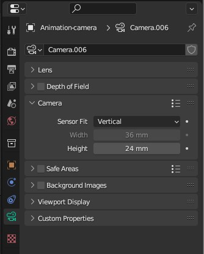
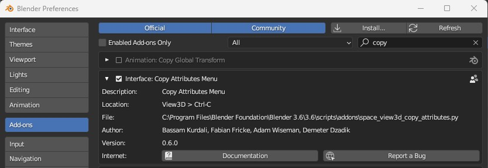
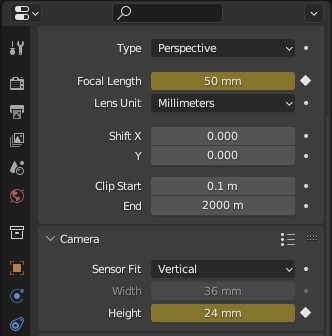
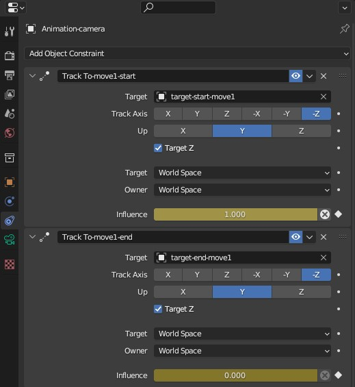

# Making a video of all matched positions

## Example data

This tutorial uses the same example data as the [image matching tutorial](./image-matching.md) - see there for links to download it.

## Prerequisites

Note that this tutorial assumes previous experience with using Blender!
It's aimed at advanced users who want to make a video that moves
smoothly between each matched position (showing the 2D image and 3D model).

## Setting up camera

First, match all your 2D images using the instructions as in the [image matching tutorial](./image-matching.md).

Then, make a new camera to use for the animation (click in the 3D viewer and do Shift + A > Camera.)

Set this camera as the active one by selecting it and Ctrl + numpad 0 (or View > Cameras > Set Active Object As Camera)

Open the camera panel, and set the 'Sensor Fit' to 'Vertical' under the Camera dropdown menu.

## Create keyframes for each position

For each 2D image:

- Move the timeline playhead to a new time
- Find the camera associated with that image (it will be inside the 'image-match' collection, then inside the collection with the same name as the image)
- Copy the Location and Rotation of this camera to your animation camera (The 'Copy Attributes Menu' addon can be useful for this - go to Edit > Preferences and select 'Add-ons' on the left. Then search for 'copy' and enable the checkbox next to 'Interface: Copy Attributes Menu'. Once done, you can click on your animation camera, then shift + click the camera you want to copy the location and rotation from, then Ctrl + C and select 'Copy Location'. Then again, with 'Copy Rotation')

- Set a keyframe for location and rotation (Select your animation camera, press I on your keyboard and select 'Location & Rotation' )
- Open the camera panel and set the Focal Length and Sensor Height (under Camera dropdown) to match the image camera.
- Insert keyframes for Focal Length and Sensor Height by clicking the small circle next to each.

## Make transitions smoother

If you're lucky, the interpolation between your keyframes will already give you nice looking camera moves. Then you can just play with the timing by moving the keyframes around on the timeline.

Often though, the default interpolation will mean that your object goes outside of the field of view and gives a bad looking transition. You can fix this in a few different ways:

- Sometimes it's enough to go to a middle point in the timeline, then adjust the camera rotation and insert a keyframe for rotation/translation.

- If not, a method that often works nicely is to use 2 track-to constraints (although it can be a bit time consuming to set up!). 
    - Go to the constraints tab, click 'Add Object Constraint' and select 'Track To'. 
    - Then, create an empty at the same location as the camera at the start of the transition (Select Camera, then Shift + S > Cursor To Selected. Then Shift + A > Empty > Plain Axes). 
    - Copy the rotation of the camera to the empty, then move the empty along its local z axis - i.e. on the same axis as the camera is pointing, until it reaches the model's surface.
    - Back in your Track To constraint, set the Target as the empty and tick 'Target Z'.
    - Play around with the empty's rotation until nothing changes when you move the 'Influence' slider between 0 and 1 (in camera view) - this  normally needs a rotation of -90 degrees around the empty's local x axis.
    - Add a Keyframe on the 'Influence' slider to be 1 at the start of the transition, and 0 at the end (It's also a good idea to set a 0 keyframe on the frame before the transition start and the frame after the transition end, to make sure it doesn't affect any other parts of your animation)
    - Now repeat these steps for the end of the transition, adding a Track To constraint that has the target as a new empty that is aligned to the position of the camera at the end of the transition. Set a keyframe on Influence to be 0 at the start of the transition and 1 at the end.
    - Now by playing around with where the influence of both switches from 0 to 1 and how fast, you can normally achieve a smooth camera move that always keeps the model in frame and gradually transitions from looking at the initial point on the model, to looking at the end point on the model.

    

- If neither of these work, then you will just have to manually keyframe the camera location/rotation until the transition looks good.

## Rendering it out

Once you're happy with your transitions, make sure your lighting / render settings are set appropriately.

Then, render it out to a PNG sequence. (On the Output tab, change the Output directory, and ensure the File Format is set to PNG, then in the top menu bar select Render > Render Animation)

Note - this will only include the 3D model as the 2D images are background images on each camera!

## Adding back the 2D images

The easiest way to add the 2D images, is to overlay them on your rendered PNG sequence using your video editing software of choice (e.g. I use Davinci Resolve). This makes it easy to modify timings etc of the 2D images appearing and disappearing without having to re-render the entire thing.

In your video editing software, you should be able to just overlay your 2D images at the appropriate timepoints. They will fill the full vertical height of the video.
